# Personal Expense Analysis (powered by local LLMs)

A local-first application designed for the visualization and analysis of personal financial data. The system integrates React, Vite, and TailwindCSS with a localized AI analysis engine for secure, private data processing.

I call it *ExpenseSense*. 

## Showcase

### Dashboard & Analytics

The central dashboard acts as the command center for your financial data. It automatically calculates total expenses and daily averages and provides rapid insights into behavioral spending habits across customizable time periods.

<div align="center">
  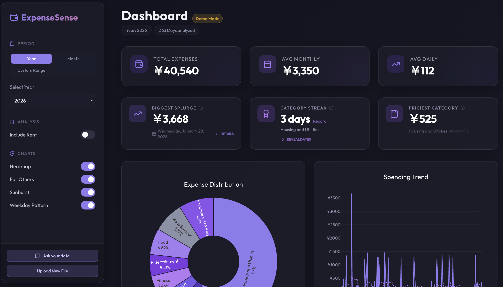
</div>

### Visualizations & Insights

A specialized analysis engine renders multiple dynamic charts to help uncover macro trends, subtle habits, and hierarchical structures in your cash flow:

<div align="center">
  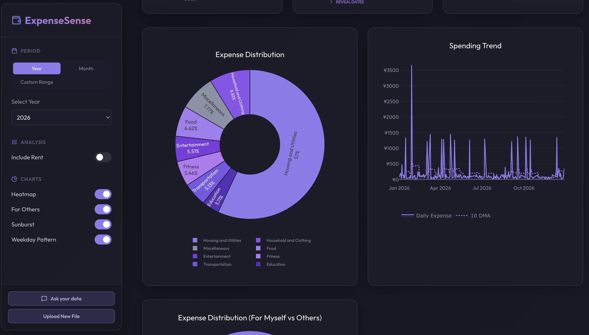
</div>
<p align="center"><b>Expense Distribution & Spending Trend:</b><br/><i>The pie chart provides a clear breakdown of where your money goes across macro categories (e.g., Housing, Food, Entertainment). At the same time, the timeseries overlays daily expenditure to show spending volatility and identify outlier "spike" days.</i></p>

<div align="center">
  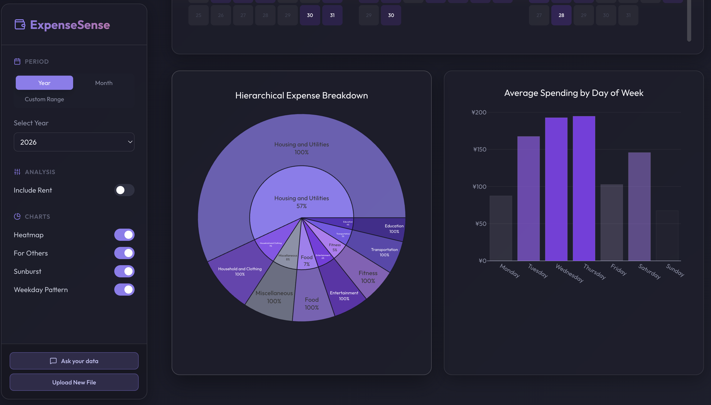
</div>
<p align="center"><b>Hierarchical Breakdown & Day of Week Averages:</b><br/><i>A sunburst chart dives deeper into sub-categories (e.g., Food -> Groceries vs. Dining), paired with a bar chart that reveals daily habits. For instance, seeing higher average spending on Fridays and Saturdays can inform behavioral adjustments.</i></p>

<div align="center">
  
</div>
<p align="center"><b>Category Heatmap (Frequency vs Magnitude):</b><br/><i>This correlation map helps distinguish between high-frequency/low-cost habits (like daily coffees) versus low-frequency/high-cost expenses (like travels).</i></p>

<div align="center">
  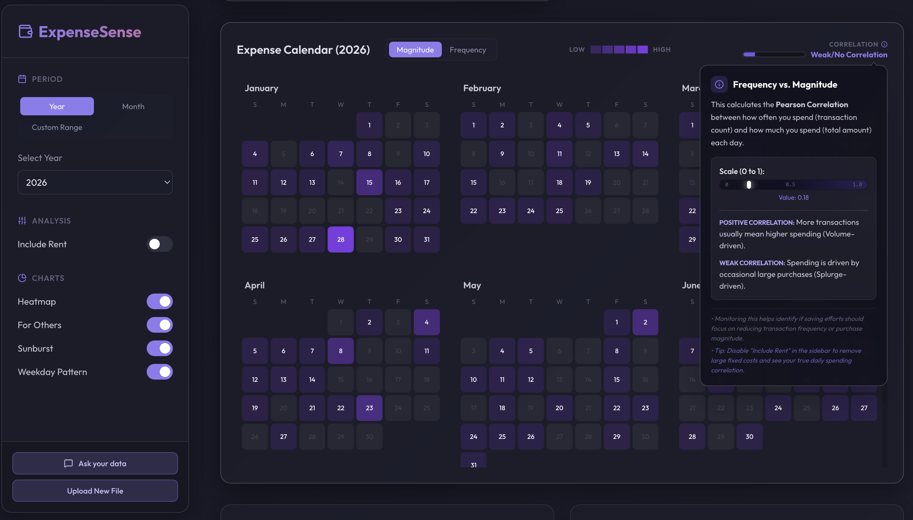
</div>
<p align="center"><b>Expense Calendar:</b><br/><i>A GitHub-style daily contribution graph applied to personal expenses. Darker days indicate heavier spending, allowing one to visually spot cyclical patterns (like end-of-month splurges or subscription billing dates).</i></p>

### Ask Your Data (local LLMs)

<div align="center">
  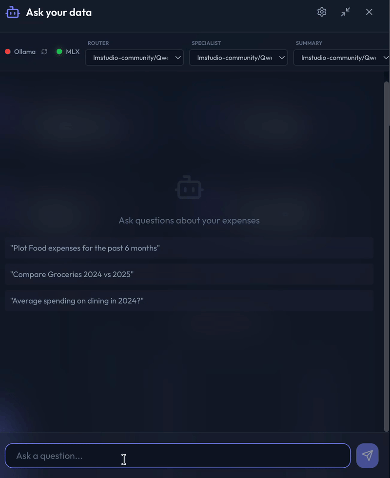
  <p><i>Querying personal expense data locally using specialized agents. The multi-agent system understands natural language and performs tool calls to answer basic questions related to the expense data.</i></p>
</div>

### LLM Pipeline Performance & Benchmarking

I tested many different models like `gemma3-1B`, `deepseek-r1 1.5B`, `phi4-mini`, etc. but found that qwen3 and granite-4 were working quite well (both accuracy and speed-wise), so I decided to benchmark across different quantizations of `Qwen3` family and `granite-4.0-h-micro`.

I benchmarked several models across the multi-agent architecture, specifically: `Qwen3-0.6B` (4-bit, 8-bit, and bf16), `granite-4.0-h-micro` (4-bit), and `Qwen3-1.7B` (4-bit and 8-bit). The benchmarking methodology evaluates **Latency** against a custom **Composite Accuracy** metric. Composite Accuracy is a weighted academic score that strictly evaluates the multi-agent pipeline:

1. **Router Accuracy (30% weight)**: Evaluates the model's deterministic capability to map natural language to the correct analytical tool.
2. **Function Output / Fn Call (50% weight)**: Assesses the Specialist agent's ability to syntactically structure the final Python execution code.
3. **Parameter Extraction (20% weight)**: Validates the semantic extraction of temporal and categorical arguments from the query into the function signature.

<div align="center">
  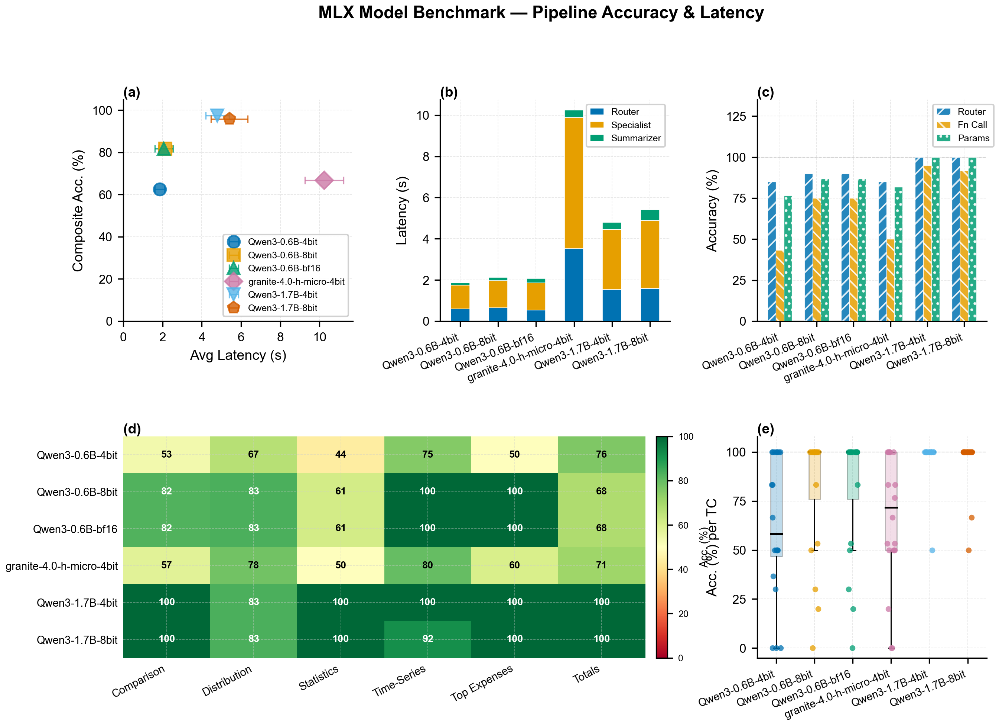
</div>
<p align="center"><b>Benchmark Summary (a–e)</b> — Five-panel overview: accuracy vs. latency scatter, stage latency, component accuracy, task category, and per-question distribution.</p>

<div align="center">
  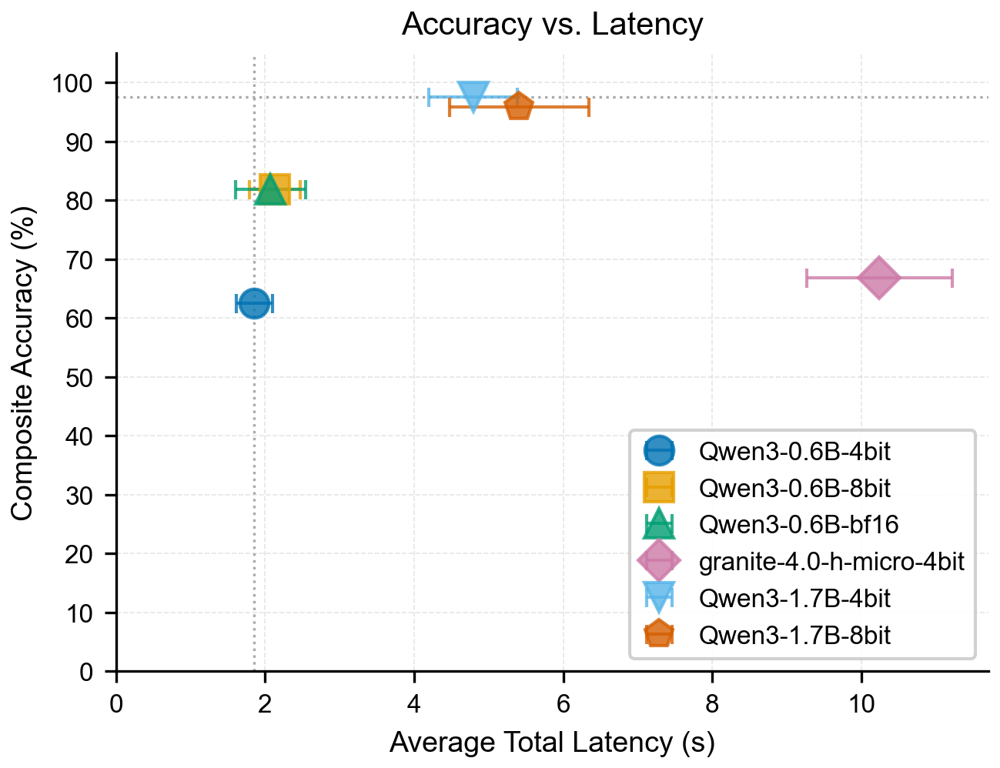
</div>
<p align="center"><b>Accuracy vs. Latency</b> — Qwen3-1.7B-4bit leads the Pareto frontier (~97%, ~4.8s). Qwen3-0.6B-8bit/bf16 are best for sub-2s use (~82%, ~2s). granite-4.0-h-micro-4bit is the slowest and least accurate (~67%, ~10.3s).</p>

<div align="center">
  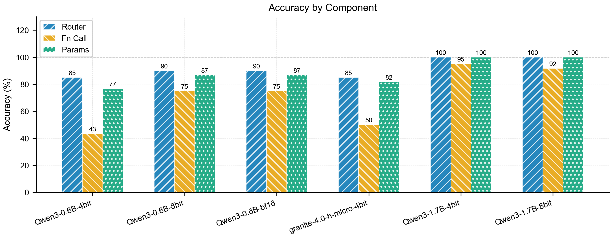
</div>
<p align="center"><b>Accuracy by Component</b> — Router accuracy is strong across all models (85–100%). The key differentiator is Fn Call accuracy: Qwen3-0.6B-4bit drops to 43% vs. 95% for Qwen3-1.7B-4bit. Parameter extraction follows the same pattern.</p>

<div align="center">
  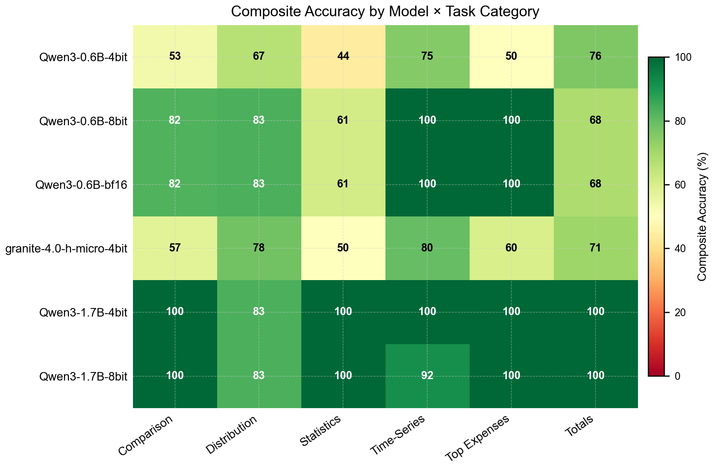
</div>
<p align="center"><b>Accuracy by Model × Task Category</b> — Simpler tools (Time-Series, Top Expenses) yield near-perfect scores across models. The hardest task is Statistics (multi-period comparison with t-test), where 0.6B models score only 44–61%.</p>

<div align="center">
  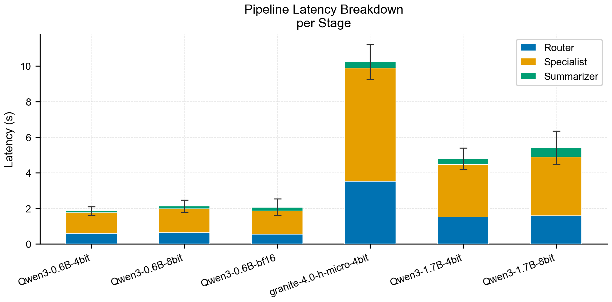
  
</div>
<p align="center"><b>Latency Breakdown & Distribution</b> — The Specialist stage dominates inference time across all models. granite-4.0-h-micro-4bit is a clear outlier (Specialist alone >6.5s, total >10s). Qwen3-0.6B variants are tight and predictable at ~2s median.</p>

<div align="center">
  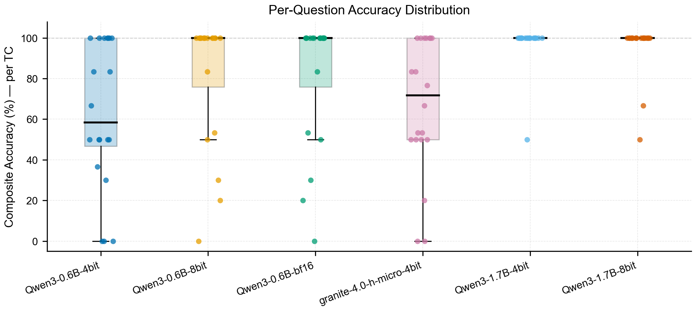
</div>
<p align="center"><b>Per-Question Score Distribution</b> — Qwen3-1.7B-4bit is the most consistent, with only two outlier questions below 100%. Qwen3-0.6B-4bit shows the widest variance (median ~58%, several zero-score failures). granite-4.0-h-micro-4bit has high median scores but unpredictable downside outliers.</p>

### Pipeline Source Files

The multi-agent pipeline is composed of the following key source files:

| File | Purpose |
| :--- | :--- |
| [`backend/utils/analysis_tools.py`](./backend/utils/analysis_tools.py) | Implements all six analytical tools (`plot_time_series`, `plot_distribution`, `plot_comparison_bars`, `calculate_total`, `calculate_statistics`, `get_top_expenses`) that the Specialist agent executes. Also contains the `auto_validate` decorator and fuzzy-matching input validation layer. |
| [`backend/utils/tool_prompts.py`](./backend/utils/tool_prompts.py) | Contains the Specialist agent's per-tool prompts. Each entry in `TOOL_PROMPTS` defines the function signature, date rules, and few-shot examples that are injected into the Specialist's context at inference time. |
| [`backend/utils/prompts/router_prompt.txt`](./backend/utils/prompts/router_prompt.txt) | The Router agent's system prompt. Defines all available tool names, their trigger keywords, and few-shot examples. The Router is instructed to output **only** a single tool name, keeping its context window minimal. |
| [`backend/utils/prompts/summary_prompt.txt`](./backend/utils/prompts/summary_prompt.txt) | The Summarizer agent's system prompt. Instructs the model to produce a concise, conversational response in JPY (¥) given the structured data output from the analysis tool. |

## Core Capabilities

### Ask Your Data (Localized Analytics)
- **Multi-Model Pipeline**: Uses a structured tri-stage pipeline (Router, Specialist, and Summary) allowing different LLM models to handle specific tasks for optimal performance and accuracy.
- **Hybrid Execution Architecture**: Prioritizes a FastAPI-based Python backend for high-performance analysis, with an automatic fallback to Pyodide (WebAssembly) for client-side processing if the backend is unavailable.
- **Performance Instrumentation**: Real-time telemetry tracks both LLM inference time and code execution duration.

### Advanced Visualization and Insights
- **Unified Graphic System**: All charts follow a consistent theme optimized for data legibility within a modern glassmorphism UI.
- **Modal Expansion**: Detailed visualizations can be expanded to full-screen modals for closer inspection.
- **Interactive Heatmaps**: Analyzes spending habits through magnitude and frequency toggles, supported by multi-year navigation.
- **Hierarchical Analysis**: Sunburst charts and category drill-downs reveal spending structures across varying levels of granularity.
- **Transactional Insights**: "Biggest Splurge" tracking includes transaction-level breakdowns and behavioral correlation analysis.

## Technical Architecture

- **Frontend**: React 18, Vite, Framer Motion, Lucide.
- **Backend (Analysis)**: FastAPI, Pandas, Plotly.
- **Local LLM Infrastructure**: Apple MLX framework for optimized inference on Apple Silicon, running models such as `Qwen3-0.6B` (4-bit/8-bit/bf16), `granite-4.0-h-micro` (4-bit), and `Qwen3-1.7B` (4-bit/8-bit), also supports Ollama.
- **In-Browser Execution**: Pyodide (WASM) for standalone client-side analysis.

## Getting Started

### Prerequisites
- **Node.js**: v18 or higher.
- **Python**: v3.10 or higher.
- **Apple MLX**: Required for localized AI inference on Apple Silicon. Install via `pip install mlx-lm`.

### Installation

1.  **Dependencies**:
    ```bash
    npm install
    ```

2.  **Backend Setup**:
    ```bash
    cd backend
    pip install -r requirements.txt
    ```

### Execution

1.  **Unified Development Mode**:
    ```bash
    npm run dev:all
    ```
    This command initializes both the Vite frontend and the FastAPI backend concurrently.

2.  **Docker Deployment**:
    ```bash
    docker-compose up --build
    ```
    The application will be accessible at `http://localhost:5173`.

## Data Schema

The system processes Excel workbooks (.xlsx or .xls) with the following required column structure:

| Column | Description |
| :--- | :--- |
| **Date** | ISO format timestamp |
| **Expense** | Numerical transaction amount |
| **remarks** | Descriptive text for semantic search |
| **category** | Primary classification tag |
| **onetime** | Boolean flag (1/0) for non-recurring expenses |
| **for others**| Boolean flag (1/0) for third-party expenses |

## Category Management

Specific transaction categories are automatically mapped into broader analytical groups. Color themes and mappings can be customized within [`src/utils/categoryMapping.js`](src/utils/categoryMapping.js).

| Analytical Group | Representative Categories |
| :--- | :--- |
| **Food** | Groceries, Dining, Cafe, Combini |
| **Fitness** | Gym, Supplements, Sports |
| **Housing & Utilities** | Rent, Utilities, Internet |
| **Transportation** | Commute, Flights, Ride Share |
| **Entertainment** | Leisure, Social Events |

## Privacy and Security

This project adheres to a strict local-first philosophy. All expenses data is processed on the user's hardware. No transactional data is transmitted to external servers or third-party cloud services.


## Motivation & Development Journey: Asking My Data

Ever since I started living independently, I've been manually logging all my expenses in an Excel sheet. My dad originally recommended I do this, and while I *could* automate importing the data from my bank or credit card statements, I found that the manual logging in an excel forced me to actually look at my past expenses and become much more cognizant of my spending habits.

The Excel sheet eventually grew quite long. To track where my money was going, I built a personal web app with static dashboards and metrics. The visual insights were great for understanding the overall *pull on my liquidity* (*cough CFA reference*) and making decisions about discretionary spending like sports merch.

But I quickly realized that static dashboards can't answer very particular questions like:
- *"Compare expenses on groceries for Jan 2026 vs Jan 2025"* (to see YoY increases)
- *"Plot spending on dining for the past 6 months"* (to see how much I spend on eating out)
- *"Get me a breakdown on spending for education for 2025"* (to see how much I spent on books and courses)

I wanted to add a feature where I could just *ask* my data these questions and have an LLM spit out the answer. Making API calls to Gemini or OpenAI would have been the easiest route, but it's not much fun. Plus, spending money on API calls to figure out how to *save* money felt *kinda ironic*.

So, I decided to make it work completely **locally** on my 4-year-old Mac M1 with only 8GB of RAM. This meant I had to limit my scope to small LLMs with 3 billion parameters or fewer (I later decided to limit to <2B parameters).

### Building the Pipeline: Three Iterations

Getting an LLM to reliably query a personal database wasn't as straightforward as it seemed. Here is how the architecture evolved:

**1. The Code Generation Approach**
My first instinct was to have local LLMs simply write Python code to answer the questions based on user input.
*The problem:* Inference took way too long because I had to cram my entire database schema and context into the prompt, and the generated code was often hallucinated or threw syntax errors.

**2. The Single-Step Tool Calling Approach**
Next, I pivoted to giving the LLM predefined "tools" (e.g., a function to plot data over a specific period, a function to compare two periods, etc.).
*The problem:* While execution accuracy improved, the input prompt was still massive because I had to supply all the tool definitions upfront, which bogged down the tiny models and choked performance.

**3. The Multi-Agent Workflow**
Finally, I designed a multi-stage **Router -> Specialist -> Summarizer** pipeline:
1. **Router**: Receives my question and strictly decides *which* tool to call.
2. **Specialist**: Receives the chosen tool and my question, then extracts the exact arguments needed (like time periods and spending categories).
3. **Summarizer** *(optional)*: Takes the data output from the tool and generates a clean, conversational answer.

**Handling LLM Quirks: The Input Validation Layer**
Even with the multi-agent setup, I quickly noticed that small LLMs aren't perfect string-matchers. If my database had a category named "Food," the Specialist might extract "food," "Food," or even append trailing whitespace. A strict programmatic database query would fail immediately on these minor discrepancies.

To fix this, I had to introduce a robust validation layer inside `analysis_tools.py`. By implementing fuzzy string matching and case-insensitive validators, the backend actively catches these tiny LLM hallucinations and corrects them *before* the script crashes. This massively improved the reliability of the 0.6B and 1.7B parameter models, allowing them to punch way above their weight class.

This approach was a massive success! Using Ollama, my pipeline latency dropped to around 20–30 seconds. However, I still wanted that snappy, instant-chat feel.

### Enter Apple MLX: Pushing Hardware Limits

To speed up inference, I stripped out Ollama and integrated Apple's native **MLX** framework, which is tailor-made for Apple Silicon. **The result? Total pipeline time plummeted to 10-15 seconds.**

With the infrastructure humming, I ran extensive benchmarks using my pipeline against several highly capable small models: `Qwen/Qwen3-0.6B-MLX-4bit`, `mlx-community/Qwen3-0.6B-8bit`, `lmstudio-community/Qwen3-0.6B-MLX-bf16`, `mlx-community/granite-4.0-h-micro-4bit`, `lmstudio-community/Qwen3-1.7B-MLX-4bit`, and `lmstudio-community/Qwen3-1.7B-MLX-8bit`.

#### The Methodology: How Do I Actually Measure "Good"?
Before looking at the numbers, it's important to understand *how* the pipeline is evaluated. Because this isn't a simple "generate text" task, standard LLM benchmarks don't apply. I wrote a comprehensive testing script that throws 20 distinct, complex queries at the pipeline, running each 5 times to account for generation variance.

The benchmark evaluates **Latency** (how fast the pipeline completes) against a custom **Composite Accuracy** metric.
Composite Accuracy is a weighted score out of 100% that strictly evaluates if the model did its job at every stage:
1. **Router Accuracy (30% weight)**: Did the first model pick the exact right tool for the job?
2. **Function Output (50% weight)**: Did the specialist model format the final Python regex correctly?
3. **Parameter Extraction (20% weight)**: Did the specialist extract all the required parameters?

#### The Results: Battle of the Small Models
The tradeoff between quantized bit-rates and parameter sizes became incredibly clear.

**The Heavyweight Champ: Qwen3 1.7B (4-bit)**
I was absolutely blown away by Alibaba's **`lmstudio-community/Qwen3-1.7B-MLX-4bit`**. Running natively via MLX, the 4-bit quantization achieved a staggering **97.5% Composite Accuracy** across all complex user query combinations, wrapping up the entire multi-stage pipeline in an average of **4.79 seconds**.

Latency distribution analysis confirmed that Qwen3 1.7B operates in a tight, predictable window without frustrating outliers. The latency breakdown reveals how the multi-agent design distributes the load: the Router and Specialist do the heavy lifting of reasoning and consume the bulk of the time, while the Summarizer is incredibly fast.

**The Lightweight Speed Demon: `mlx-community/Qwen3-0.6B-8bit`**
If I am completely starved for RAM, this model is absurdly efficient. It executes the entire pipeline in **2.1 seconds** while maintaining a highly respectable **81.8% accuracy**.

While top-line accuracy numbers are impressive, extracting arguments for complex tools—like multi-layered "Statistics" or specific "Comparisons"—is what separates the good models from the great ones. The 0.6B model struggles significantly more on these nuanced tasks compared to basic retrieval.

### Real-World Impact: The 30% Snack Cut

Once the MLX pipeline was fully integrated, I tested the chat interface by asking it: *"Plot my spendings on snacks for the past X months."* I forgot the exact number but it was >=6 months afaik. The dynamically generated Plotly chart it returned was a serious wake-up call. I realized my snack spending was not so healthy, considering I wasn't running enough to justify it.
I decided to cut down on snacks, but wasn't immediately successful, so I decided to place a bet with a Uni friend about who could go completely sugarless for the longest time (this has worked in the past as I dislike losing). 
Thanks to the ability to literally just "ask my data" about my habits, **my spend on expenses dropped by 33% MoM (Dec 25 vs Jan 26)**.

<div align="center">
  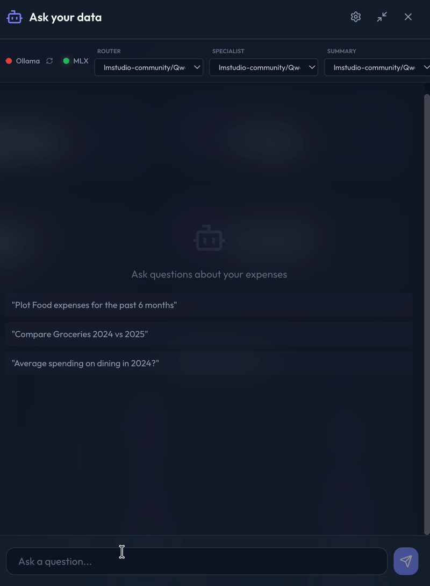
</div>

It's been a rewarding project. I inadvertently learned the intricacies of small local LLMs, inference, and fine tuning (although I didn't perform it, as the accuracy without fine-tuning is pretty good).
I was able to improve my health + my wallet.

The ability to build apps for personal-use using IDEs like Antigravity is fantastic (turning vision to reality is quick and what one can build is often limited to one's imagination I guess).
